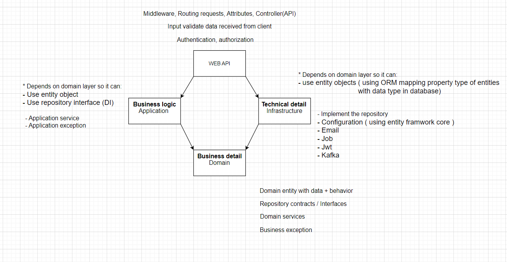
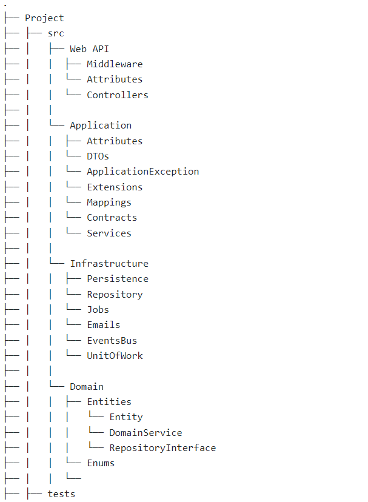

# Business Logic Flow
1. Controller:
Controller chiệu trách nhiệm cho những HTTP requests đươc gửi đến, nhận requests, validate the data, call the corresponding application services để xử lý business logic
2. Application Service:
Application service là nơi trung gian giữa controller và business logic. Điều phối flow business logic bằng cách invoking những method cần thiết từ domain service và tương tác với database thông qua repository. Exception trong layer này là application exception
3. Domain Service
Domain service chứa những core business logic. handles những logic phức tạp hơn thay vì xử lý hết chúng trong behavior của entity. Domain service tương tác với các behavior của entity hoặc repository nếu cần. Exception trong layer này là business exception
4. Repository 
Repository chiệu trách nhiệm cho việc truy cập và thao tác data. cung cấp những interfaces/abtraction cho phép Application Services and Domain Services tương tác với data mà không cần xử lý trực tiếp với database

# Image

# Folder structure
